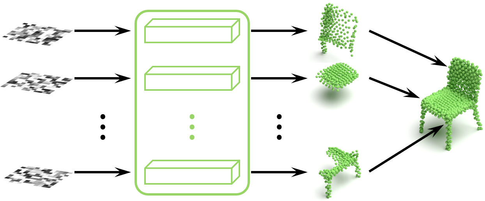

# Patch-wise Generation

It is the PyTorch implementation of the paper:  
### [Patch-Wise Point Cloud Generation: A Divide-and-Conquer Approach](https://arxiv.org/pdf/2307.12049)  
&nbsp; &nbsp; &nbsp; &nbsp; &nbsp; &nbsp; &nbsp; &nbsp; &nbsp; &nbsp; &nbsp; &nbsp; &nbsp; &nbsp; **Cheng Wen, Baosheng Yu, Rao Fu, Dacheng Tao**

## Abstract
A generative model for high-fidelity point clouds is of great importance in synthesizing 3d environments for applications such as autonomous driving and robotics. Despite the recent success of deep generative models for 2d images, it is non-trivial to generate 3d point clouds without a comprehensive understanding of both local and global geometric structures. In this paper, we devise a new 3d point cloud generation framework using a divide-and-conquer approach, where the whole generation process can be divided into a set of patch-wise generation tasks. Specifically, all patch generators are based on learnable priors, which aim to capture the information of geometry primitives. We introduce point- and patch-wise transformers to enable the interactions between points and patches. Therefore, the proposed divide-and-conquer approach contributes to a new understanding of point cloud generation from the geometry constitution of 3d shapes. Experimental results on a variety of object categories from the most popular point cloud dataset, ShapeNet, show the effectiveness of the proposed patch-wise point cloud generation, where it clearly outperforms recent state-of-the-art methods for high-fidelity point cloud generation. 

<div align="left">


## Citation
If you find our work useful in your research, please consider citing:
```
@article{wen2023patch,
  title={Patch-Wise Point Cloud Generation: A Divide-and-Conquer Approach},
  author={Wen, Cheng and Yu, Baosheng and Fu, Rao and Tao, Dacheng},
  journal={arXiv preprint arXiv:2307.12049},
  year={2023}
}
```


## Enviroments
To run this code, you need first install these python packages:  
```
python 3.8  
pytorch 1.10  
torchvision, numpy, tqdm, h5py, plyfile, matplotlib, scipy, networkx  
```

## Dataset

## Usage

## License
The code is released under MIT License (see LICENSE file for details).
